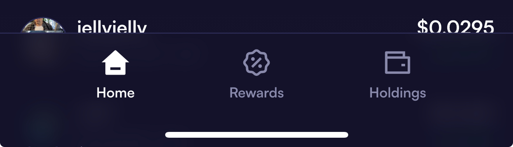
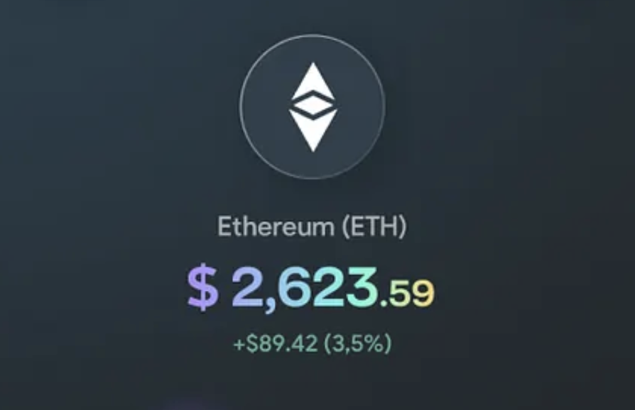
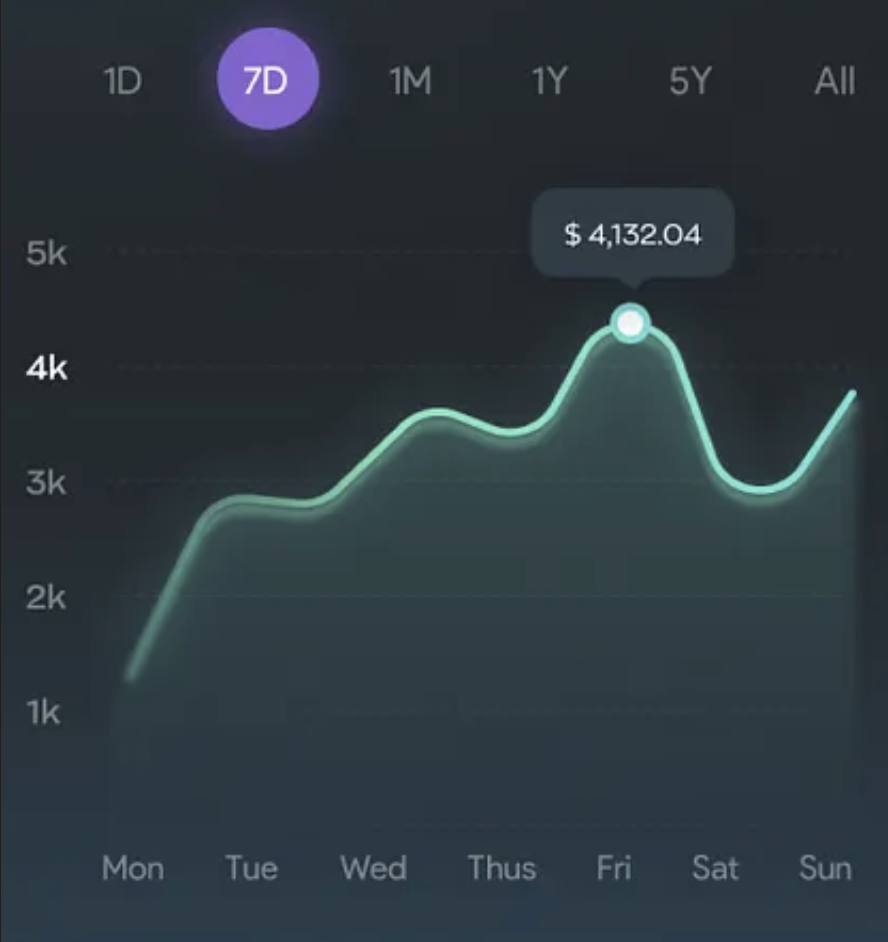
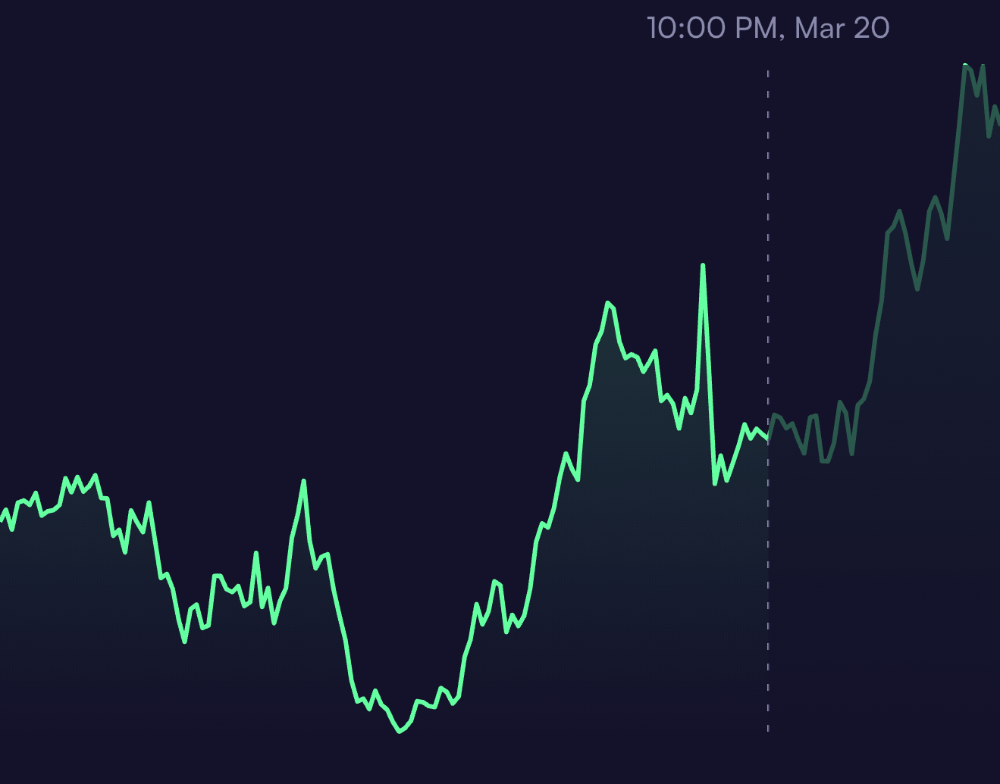
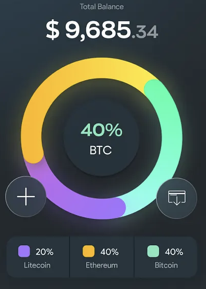

# 🎮 Dankfolio

## Environment Setup

This project includes scripts to help you configure your development environment quickly: `setup-frontend.sh` and `setup-backend.sh`. You can run them independently based on which part of the project you're working on.

The `setup-frontend.sh` script will attempt to:
- Install NVM (Node Version Manager) if it's not already present.
- Install the correct Node.js version as specified in the `.nvmrc` file.
- Install Yarn (if it's not already present).
- Install frontend dependencies using `yarn install` in the `frontend` directory.
- Create a `frontend/.env` file from `frontend/.env.example` if it doesn't already exist.

The `setup-backend.sh` script will attempt to:
- Check if Go, buf, and protoc are installed and guide you if they are missing.
- Install specific versions of Go gRPC plugins (`protoc-gen-go`, `protoc-gen-go-grpc`).
- Install `mockery` for generating mocks.
- Install backend Go dependencies using `go mod download` in the `backend` directory.
- Generate Go code from Protocol Buffer definitions using `buf generate`.
- Run `mockery` to generate necessary mock files within the `backend` directory.
- Create a `backend/.env` file from `backend/.env.example` if it doesn't already exist.

### Running the Scripts

1.  Make sure the scripts are executable:
    ```bash
    chmod +x setup-frontend.sh setup-backend.sh
    ```
2.  Run the desired script(s) from the root of the project:
    To set up the frontend:
    ```bash
    ./setup-frontend.sh
    ```
    To set up the backend:
    ```bash
    ./setup-backend.sh
    ```
    You can run one or both, depending on your needs.

3.  Pay attention to the output of the scripts. They will guide you if any dependencies are missing or if any manual steps are required.

### After Running the Scripts

- The `setup-frontend.sh` script will copy `frontend/.env.example` to `frontend/.env` if it doesn't already exist.
  - **`frontend/.env`**: Review this file. Notably, `DEV_APP_CHECK_TOKEN` is now used for Firebase App Check verification in development/simulator environments for both Android and iOS. The previous variables `FIREBASE_APP_CHECK_DEBUG_TOKEN_ANDROID` and `FIREBASE_APP_CHECK_DEBUG_TOKEN_IOS` have been removed and are no longer used.
- The `setup-backend.sh` script will copy `backend/.env.example` to `backend/.env` if it doesn't already exist.
  - **`backend/.env`**: Review this file. A new `DEV_APP_CHECK_TOKEN` variable has been added. This token is used by the backend for App Check verification when the `APP_ENV` is set to "development", "local", or "production-simulator", bypassing standard Firebase App Check for easier local development and testing.
- **Important**: You will need to manually review and update these `.env` files with your specific configurations (API keys, database credentials, your actual `DEV_APP_CHECK_TOKEN` value, etc.).
- Follow any additional "Next steps" printed by the scripts at the end of their execution.

## JWT SECRET
```bash
→ openssl rand -hex 32
31b6e992701acc729eed45f137c117e8530fd8b74a70da7b27d2ba85a203dacd
```
## On start crash logs
``` bash
xcrun simctl spawn booted log stream --predicate 'process == "Expo Go" OR process CONTAINS "dankfolio"' --style compact
```

```bash
→ grpcurl -plaintext \
  -import-path proto/dankfolio/v1 \
  -proto coin.proto \
  -d '{}' \
  localhost:9000 \
  dankfolio.v1.CoinService/GetAllCoins
```

### Improvements
- [x] Add contract display in coin details
- [x] Add more space to the coin name in profile and home
- [x] Improve graph usability
    - [x] Formatted DT on graph when dragging
    - [x] Fix change update and color
    - [x] Hover label position fix when reaching the edge of the screen
    - [x] Label, vertical line and domain padding
    - [x] Shadow when highlighting
    - [x] Double check data accuracy when highligting the graph


### 💅 UI Improvements

| Task | Reference |
|------|-----------|
| <li>[x] Improve Button Bar Design </li>| <details><summary>View Design</summary></details> |
| <li>[ ] Enhance Coins Detail Header </li>| <details><summary>View Design</summary></details> |
| <li>[ ] Update Chart Style </li>| <details><summary>View Design</summary></details> |
| <li>[ ] Implement Price Chart Highlight</li>| <details><summary>View Design</summary></details> |
| <li>[x] Create Profile Wallet Breakdown</li>  | <details><summary>View Design</summary></details> |


## hard reset
```bash 
rm -rf ./node_modules && yarn install && cd ios && rm -rf build Pods Podfile.lock && pod install && cd .. && yarn start --reset-cache
```

## CodeCoverage
```

yarn run v1.22.22
$ jest --coverage
 PASS  src/store/auth.test.ts
 PASS  src/components/Chart/CoinChart/index.test.tsx
 PASS  src/screens/Profile/ProfileScreen.test.tsx
 PASS  src/screens/Home/HomeScreen.test.tsx
 PASS  src/store/coins.test.ts
 PASS  src/screens/Trade/TradeScreen.Confirmation.test.tsx
 PASS  src/components/Common/Navigation/navigation.test.tsx
 PASS  src/services/authService.test.ts
 PASS  src/screens/Trade/TradeScreen.test.tsx
 PASS  src/components/Trade/TradeConfirmation/TradeConfirmation.test.tsx
 PASS  src/screens/CoinDetail/coindetail_scripts.test.ts
 PASS  src/store/portfolio.test.ts
 PASS  src/utils/numberFormat.test.ts
 PASS  src/services/api.test.ts
 PASS  src/store/priceHistoryCache.test.ts
 PASS  src/screens/CoinDetail/CoinDetailScreen.test.tsx
 PASS  src/components/Common/TokenSelector/TokenSelector.test.tsx
A worker process has failed to exit gracefully and has been force exited. This is likely caused by tests leaking due to improper teardown. Try running with --detectOpenHandles to find leaks. Active timers can also cause this, ensure that .unref() was called on them.
------------------------------------|---------|----------|---------|---------|----------------------------------------------------------------------------------------------------
File                                | % Stmts | % Branch | % Funcs | % Lines | Uncovered Line #s
------------------------------------|---------|----------|---------|---------|----------------------------------------------------------------------------------------------------
All files                           |   61.09 |    52.31 |   62.42 |   61.58 |
 components/Chart/CoinChart         |   40.25 |    26.66 |    37.5 |   42.25 |
  index.tsx                         |   38.66 |    26.66 |   34.78 |   41.42 | 55-141,197-200,216-217,229-232,248-314
  styles.ts                         |     100 |      100 |     100 |     100 |
 components/Common/CachedImage      |   60.86 |       36 |      25 |   60.86 |
  index.tsx                         |   60.86 |       36 |      25 |   60.86 | 25,49-53,71-72,76-77
 components/Common/Icons            |   51.78 |        0 |    7.69 |   82.35 |
  index.tsx                         |   51.78 |        0 |    7.69 |   82.35 | 22-23,27-28,32-33
 components/Common/Navigation       |     100 |      100 |     100 |     100 |
  CustomHeader.tsx                  |     100 |      100 |     100 |     100 |
 components/Common/TokenSelector    |   75.71 |    51.11 |   70.83 |   77.61 |
  index.tsx                         |      86 |    56.25 |   73.68 |    87.5 | 14-15,34,41-42,210
  scripts.ts                        |   44.44 |    38.46 |      50 |   47.05 | 10-23,39-40
  styles.ts                         |     100 |      100 |     100 |     100 |
 components/Home/CoinCard           |   71.42 |    35.71 |      80 |      75 |
  coincard_styles.ts                |     100 |      100 |     100 |     100 |
  index.tsx                         |   66.66 |    35.71 |      75 |   72.72 | 25-39
 components/OTAupdate               |      25 |     3.84 |   42.85 |   27.77 |
  index.tsx                         |      75 |       50 |   66.66 |      75 | 16-17
  scripts.ts                        |    9.67 |        0 |      25 |   11.11 | 7-11,18-52
  styles.ts                         |     100 |      100 |     100 |     100 |
 components/Trade/TradeConfirmation |     100 |     92.3 |     100 |     100 |
  index.tsx                         |     100 |     92.3 |     100 |     100 | 19
  styles.ts                         |     100 |      100 |     100 |     100 |
 components/Trade/TradeStatusModal  |   78.21 |    66.66 |   90.47 |   78.35 |
  index.tsx                         |   83.33 |    75.43 |   91.66 |   84.12 | 62,69,103-105,116-118,129-131,210,222
  scripts.ts                        |   66.66 |    48.14 |    87.5 |   66.66 | 12-14,18-20,30-32,36-38,48-51,64
  styles.ts                         |     100 |      100 |     100 |     100 |
 gen/dankfolio/v1                   |     100 |      100 |     100 |     100 |
  auth_pb.ts                        |     100 |      100 |     100 |     100 |
  coin_pb.ts                        |     100 |      100 |     100 |     100 |
  price_pb.ts                       |     100 |      100 |     100 |     100 |
  trade_pb.ts                       |     100 |      100 |     100 |     100 |
  utility_pb.ts                     |     100 |      100 |     100 |     100 |
  wallet_pb.ts                      |     100 |      100 |     100 |     100 |
 screens/CoinDetail                 |   84.05 |    66.66 |   91.66 |   83.84 |
  coindetail_scripts.ts             |      75 |    48.27 |   83.33 |   74.28 | 114-117,144,164-194
  coindetail_styles.ts              |     100 |      100 |     100 |     100 |
  index.tsx                         |   93.75 |    82.35 |   94.11 |   94.91 | 48,87,181
 screens/Home                       |   87.23 |       60 |   72.22 |   86.66 |
  home_scripts.ts                   |   66.66 |      100 |       0 |   66.66 | 60
  home_styles.ts                    |     100 |      100 |     100 |     100 |
  index.tsx                         |   88.09 |       60 |      75 |    87.8 | 40,80,92-96
 screens/Profile                    |   61.42 |    56.25 |   73.91 |    62.5 |
  index.tsx                         |   69.76 |    66.66 |      75 |   70.73 | 42-53,74-75,99-100,198
  profile_scripts.ts                |      44 |       25 |   66.66 |   45.45 | 16-26,49-60
  profile_styles.ts                 |     100 |      100 |     100 |     100 |
 screens/Trade                      |   57.03 |    55.25 |   73.33 |   56.56 |
  index.tsx                         |   71.42 |    64.17 |   83.78 |   71.48 | ...299-300,303-304,308-309,318-319,328-329,364-365,368-369,377-378,384-386,389-391,401-408,415-416
  trade_scripts.ts                  |   12.63 |     3.12 |   14.28 |   12.63 | 18-23,35-90,104-107,115-117,131-166,177-185,203-254
  trade_styles.ts                   |     100 |      100 |     100 |     100 |
 services                           |   18.59 |    16.07 |      25 |   18.59 |
  authService.ts                    |   51.89 |       45 |     100 |   51.89 | 53-54,113-114,143-209
  firebaseInit.ts                   |      10 |        0 |       0 |      10 | 18-23,39-108
  grpcApi.ts                        |    0.75 |        0 |       0 |    0.75 | 12,21-394
 services/grpc                      |   29.82 |     3.33 |       0 |   30.35 |
  apiClient.ts                      |   52.63 |       25 |       0 |   55.55 | 15,20-30
  grpcUtils.ts                      |   18.42 |        0 |       0 |   18.42 | 11,31-37,42-43,48-53,57-77,81,89-93
 store                              |   90.96 |    71.42 |   96.77 |   90.36 |
  auth.ts                           |     100 |    82.35 |     100 |     100 | 60-86
  coins.ts                          |      92 |       60 |     100 |    91.3 | 47-50
  portfolio.ts                      |    82.6 |    61.11 |      90 |   81.25 | 43,52,66-70,78-88,94-95,121-122
  priceHistoryCache.ts              |     100 |      100 |     100 |     100 |
 utils                              |   75.92 |    75.51 |      75 |    77.1 |
  constants.ts                      |     100 |      100 |     100 |     100 |
  logger.ts                         |   41.93 |    21.42 |   66.66 |   54.16 | 20-25,55-62,70
  numberFormat.ts                   |     100 |      100 |     100 |     100 |
  url.ts                            |      20 |        0 |       0 |      20 | 5,9-18
------------------------------------|---------|----------|---------|---------|----------------------------------------------------------------------------------------------------

Test Suites: 17 passed, 17 total
Tests:       132 passed, 132 total
Snapshots:   0 total
Time:        2.628 s, estimated 3 s
✨  Done in 3.31s.
```
