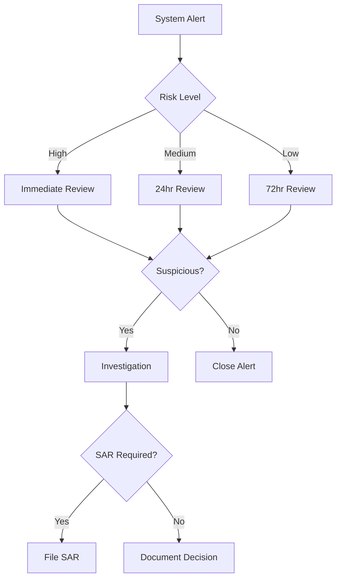

# KYC/AML Requirements for Cryptocurrency Exchanges

## Overview

This document outlines the Know Your Customer (KYC) and Anti-Money Laundering (AML) requirements for Dankfolio's fiat-to-crypto operations. These requirements are mandated by FinCEN, state regulators, and international standards to prevent money laundering, terrorist financing, and other financial crimes.

## Table of Contents

1. [Regulatory Framework](#regulatory-framework)
2. [KYC Requirements](#kyc-requirements)
3. [AML Program Components](#aml-program-components)
4. [Transaction Monitoring](#transaction-monitoring)
5. [Reporting Obligations](#reporting-obligations)
6. [Technology Stack](#technology-stack)
7. [Implementation Timeline](#implementation-timeline)

## Regulatory Framework

### Federal Requirements

**Bank Secrecy Act (BSA)**
- Primary federal AML law
- Requires MSBs to implement AML programs
- Mandates reporting of suspicious activities

**USA PATRIOT Act**
- Enhanced due diligence requirements
- Mandatory customer identification program (CIP)
- Information sharing provisions (314(a) and 314(b))

**FinCEN Guidance**
- FIN-2019-G001: Virtual currency guidance
- Customer due diligence (CDD) rule
- Beneficial ownership requirements

### International Standards

**FATF Recommendations**
- Risk-based approach
- Enhanced due diligence for high-risk customers
- Travel Rule compliance (Recommendation 16)

## KYC Requirements

### Customer Identification Program (CIP)

#### Minimum Information Collection

**Individual Customers**
```yaml
required_information:
  - full_legal_name
  - date_of_birth
  - residential_address
  - identification_number:
      us_persons: SSN or ITIN
      non_us_persons: Passport number and country
```

**Business Customers**
```yaml
required_information:
  - legal_business_name
  - business_address
  - EIN_or_tax_id
  - formation_documents
  - beneficial_ownership:
      threshold: 25% ownership
      control_persons: true
```

#### Identity Verification Methods

**Documentary Verification**
- Government-issued photo ID (passport, driver's license)
- Proof of address (utility bill, bank statement)
- Business formation documents

**Non-Documentary Verification**
- Database checks (LexisNexis, Experian)
- Credit bureau verification
- Public records search
- Blockchain analytics

### KYC Tiers and Limits

```typescript
// KYC Tier Structure
interface KYCTier {
  level: number;
  name: string;
  dailyLimit: number;
  monthlyLimit: number;
  requirements: string[];
  features: string[];
}

const KYC_TIERS: KYCTier[] = [
  {
    level: 0,
    name: "Unverified",
    dailyLimit: 0,
    monthlyLimit: 0,
    requirements: [],
    features: ["View prices", "Wallet connection"]
  },
  {
    level: 1,
    name: "Basic",
    dailyLimit: 1000,
    monthlyLimit: 10000,
    requirements: [
      "Email verification",
      "Phone verification",
      "Name and DOB"
    ],
    features: ["Buy crypto", "Basic trading"]
  },
  {
    level: 2,
    name: "Intermediate",
    dailyLimit: 10000,
    monthlyLimit: 50000,
    requirements: [
      "Government ID",
      "Address verification",
      "Selfie verification"
    ],
    features: ["Higher limits", "All payment methods"]
  },
  {
    level: 3,
    name: "Advanced",
    dailyLimit: 50000,
    monthlyLimit: 500000,
    requirements: [
      "Source of funds",
      "Employment verification",
      "Enhanced due diligence"
    ],
    features: ["Highest limits", "OTC trading", "Priority support"]
  }
];
```

### Customer Due Diligence (CDD)

#### Risk Assessment Matrix

```markdown
| Factor | Low Risk | Medium Risk | High Risk |
|--------|----------|-------------|-----------|
| Geography | US, EU, UK | Asia, Latin America | FATF Grey/Black list |
| Transaction Volume | <$10k/month | $10k-50k/month | >$50k/month |
| Transaction Pattern | Regular, consistent | Some irregularities | Unusual patterns |
| Customer Type | Employed individual | Self-employed | PEP, Shell company |
| Payment Method | Bank transfer | Credit card | Cash, Crypto |
```

#### Enhanced Due Diligence (EDD)

Required for high-risk customers:
1. Source of wealth documentation
2. Source of funds verification
3. Purpose of account/relationship
4. Ongoing monitoring frequency increased
5. Senior management approval

### Ongoing Monitoring

**Account Review Triggers**
- Dormant account reactivation
- Significant change in transaction patterns
- Change in customer risk profile
- Negative news or sanctions hits

**Refresh Requirements**
- Low risk: Every 3 years
- Medium risk: Every 2 years
- High risk: Annually
- PEPs: Every 6 months

## AML Program Components

### 1. Written AML Policy

**Required Elements**
```markdown
1. Statement of Commitment
   - Board/senior management approval
   - Zero tolerance for money laundering
   
2. Risk Assessment
   - Customer risk
   - Product risk
   - Geographic risk
   - Channel risk
   
3. Internal Controls
   - Customer due diligence procedures
   - Transaction monitoring systems
   - Sanctions screening
   - Record keeping
   
4. Independent Testing
   - Annual third-party audit
   - Scope and methodology
   - Remediation procedures
   
5. Designated Compliance Officer
   - Qualifications
   - Responsibilities
   - Reporting structure
   
6. Training Program
   - Annual requirements
   - Role-based modules
   - Testing and certification
```

### 2. Compliance Officer

**Responsibilities**
- Day-to-day AML compliance
- SAR filing decisions
- Training coordination
- Regulatory liaison
- Program updates

**Qualifications**
- CAMS certification preferred
- 5+ years compliance experience
- Knowledge of crypto regulations
- Strong analytical skills

### 3. Training Program

**Annual Training Topics**
1. AML/BSA overview
2. Red flags identification
3. SAR filing procedures
4. Sanctions compliance
5. Crypto-specific risks
6. Internal policies

**Training Matrix**
```markdown
| Role | Frequency | Duration | Topics |
|------|-----------|----------|---------|
| All Staff | Annual | 2 hours | Basic AML |
| Customer Service | Quarterly | 1 hour | Red flags |
| Compliance | Monthly | 2 hours | Advanced topics |
| Developers | Annual | 1 hour | Privacy vs compliance |
| Executives | Annual | 1 hour | Liability & oversight |
```

### 4. Independent Testing

**Annual Audit Scope**
- Policy adequacy
- Procedure effectiveness
- System validation
- Training assessment
- Regulatory compliance

**Testing Procedures**
1. Transaction testing (sample-based)
2. SAR decision review
3. Sanctions screening validation
4. Customer file review
5. System access controls

## Transaction Monitoring

### Automated Monitoring Rules

```typescript
// Example Monitoring Rules
interface MonitoringRule {
  id: string;
  name: string;
  description: string;
  threshold: number;
  period: string;
  action: string;
}

const MONITORING_RULES: MonitoringRule[] = [
  {
    id: "VEL001",
    name: "Velocity Rule",
    description: "Multiple transactions in short period",
    threshold: 10,
    period: "1 hour",
    action: "FLAG_REVIEW"
  },
  {
    id: "AMT001",
    name: "Large Transaction",
    description: "Single transaction over threshold",
    threshold: 10000,
    period: "immediate",
    action: "ENHANCED_REVIEW"
  },
  {
    id: "STR001",
    name: "Structuring Detection",
    description: "Multiple transactions below CTR threshold",
    threshold: 9000,
    period: "24 hours",
    action: "SAR_REVIEW"
  },
  {
    id: "GEO001",
    name: "High-Risk Geography",
    description: "Transaction to/from sanctioned country",
    threshold: 1,
    period: "immediate",
    action: "BLOCK"
  }
];
```

### Blockchain Analytics Integration

**On-Chain Monitoring**
- Source of funds analysis
- Wallet risk scoring
- Mixer/tumbler detection
- Darknet market exposure
- Sanctions address screening

**Risk Indicators**
```yaml
high_risk_indicators:
  - multiple_hops_from_exchange
  - mixer_interaction
  - darknet_market_exposure
  - sanctioned_address_interaction
  - unusual_transaction_patterns

medium_risk_indicators:
  - new_wallet_address
  - cross_chain_activity
  - defi_protocol_interaction
  - high_transaction_velocity

low_risk_indicators:
  - verified_exchange_source
  - consistent_patterns
  - established_wallet_history
```

### Alert Management

**Alert Workflow**


## Reporting Obligations

### Suspicious Activity Reports (SARs)

**Filing Requirements**
- Timeline: 30 days from detection
- Extension: Additional 30 days if needed
- No customer notification allowed
- Retain records for 5 years

**SAR Triggers**
```markdown
1. Transaction Patterns
   - Structuring to avoid reporting
   - No apparent business purpose
   - Unusual for customer profile
   
2. Customer Behavior
   - Reluctance to provide information
   - False/altered documentation
   - Unusual concern about compliance
   
3. Crypto-Specific
   - Mixing service usage
   - Rapid wallet churning
   - Cross-chain obfuscation
   - DeFi protocol abuse
```

### Currency Transaction Reports (CTRs)

**Requirements**
- Cash transactions >$10,000
- File within 15 days
- Aggregate multiple transactions
- Include virtual currency conversions

### Travel Rule Compliance

**Information Required**
```json
{
  "originator": {
    "name": "John Smith",
    "account_number": "wallet_address",
    "address": "123 Main St, City, State",
    "identity_number": "SSN/Passport"
  },
  "beneficiary": {
    "name": "Jane Doe",
    "account_number": "wallet_address"
  },
  "transaction": {
    "amount": 3500,
    "currency": "USD",
    "crypto_amount": 0.1,
    "crypto_currency": "BTC"
  }
}
```

## Technology Stack

### KYC/AML Vendors

**Identity Verification**
- **Jumio**: AI-powered ID verification
- **Onfido**: Biometric verification
- **Trulioo**: Global identity verification
- **Socure**: Predictive analytics

**Transaction Monitoring**
- **Chainalysis**: Blockchain analytics
- **Elliptic**: Crypto compliance
- **TRM Labs**: Risk management
- **CipherTrace**: AML for crypto

**Case Management**
- **Sardine**: Fraud and compliance platform
- **Unit21**: No-code AML platform
- **Hummingbird**: Regulatory technology

### Integration Architecture

```yaml
kyc_aml_architecture:
  frontend:
    - sdk: Jumio Web SDK
    - flow: Progressive KYC
    - storage: Encrypted local only
    
  backend:
    orchestration:
      - service: KYC Service
      - queue: Async processing
      - storage: Encrypted S3
      
    vendors:
      identity:
        - primary: Jumio
        - fallback: Onfido
      
      screening:
        - sanctions: OFAC, UN, EU
        - pep: World-Check
        - adverse_media: LexisNexis
      
      blockchain:
        - primary: Chainalysis
        - secondary: Elliptic
    
    storage:
      - documents: Encrypted S3
      - metadata: PostgreSQL
      - audit_logs: Immutable store
```

### Data Retention

**Retention Periods**
```markdown
| Data Type | Retention Period | Storage Location |
|-----------|-----------------|------------------|
| KYC Documents | 5 years after relationship ends | Encrypted S3 |
| Transaction Records | 5 years | PostgreSQL |
| SARs | 5 years from filing | Secure archive |
| CTRs | 5 years from filing | Secure archive |
| Communication Logs | 5 years | Audit database |
| Training Records | 6 years | HR system |
```

## Implementation Timeline

### Phase 1: Foundation (Months 1-2)
- [ ] Appoint Compliance Officer
- [ ] Draft AML Policy
- [ ] Select KYC vendor
- [ ] Design risk assessment

### Phase 2: Technology (Months 2-4)
- [ ] Integrate KYC provider
- [ ] Implement transaction monitoring
- [ ] Set up case management
- [ ] Configure sanctions screening

### Phase 3: Operations (Months 4-5)
- [ ] Train staff
- [ ] Conduct testing
- [ ] Document procedures
- [ ] Establish QA process

### Phase 4: Launch (Month 6)
- [ ] Independent audit
- [ ] Regulatory notifications
- [ ] Go-live monitoring
- [ ] Ongoing optimization

## Compliance Metrics

### Key Performance Indicators

```markdown
| Metric | Target | Measurement |
|--------|--------|-------------|
| KYC Completion Rate | >95% | Monthly |
| False Positive Rate | <20% | Weekly |
| Alert Review Time | <24hrs | Daily |
| SAR Quality Score | >90% | Quarterly |
| Training Completion | 100% | Annual |
| Audit Findings | <5 | Annual |
```

### Management Reporting

**Monthly Compliance Dashboard**
1. Active customers by risk tier
2. Alerts generated and cleared
3. SARs filed
4. System performance metrics
5. Regulatory changes summary

## Best Practices

### Customer Experience
1. Progressive KYC - collect minimum required
2. Clear explanations for information requests
3. Fast verification turnaround
4. Transparent status updates
5. Alternative verification methods

### Operational Excellence
1. Regular rule tuning to reduce false positives
2. Continuous staff training
3. Vendor performance monitoring
4. Regulatory intelligence updates
5. Cross-functional collaboration

### Risk Management
1. Regular risk assessments
2. Scenario testing
3. Emerging threat monitoring
4. Peer intelligence sharing
5. Proactive regulatory engagement

## Conclusion

A robust KYC/AML program is essential for regulatory compliance and business sustainability. The key is balancing regulatory requirements with customer experience while maintaining operational efficiency. Regular reviews and updates ensure the program remains effective against evolving threats and regulations.