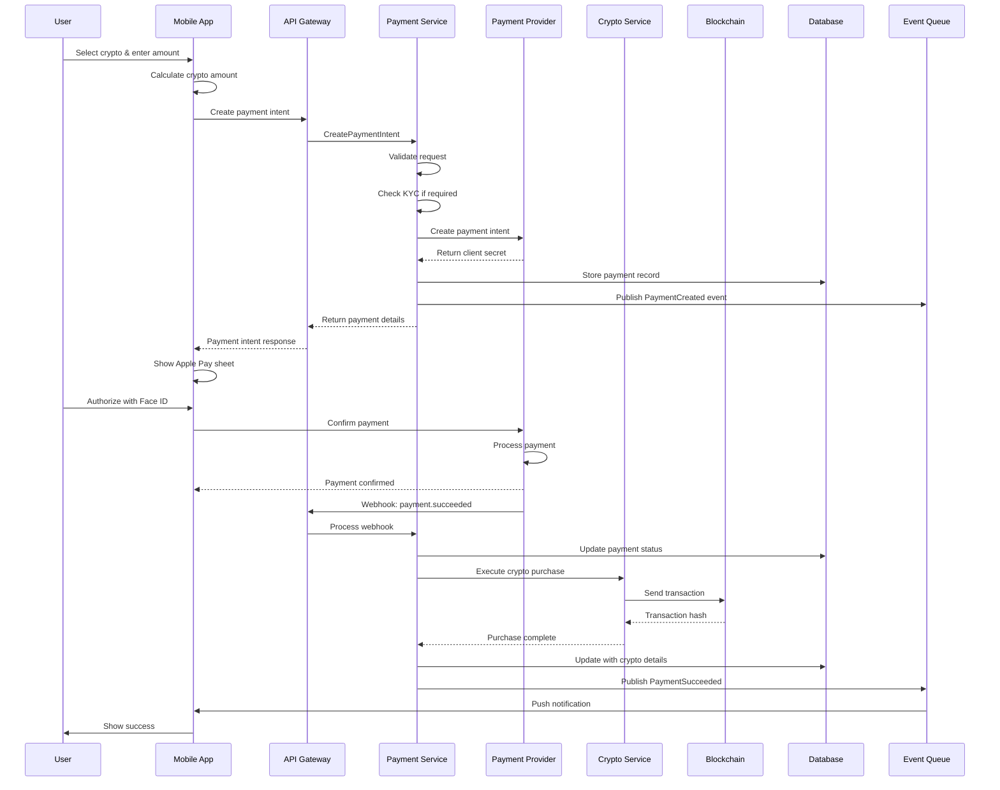

# Payment Flow Documentation

## Overview

This document describes the end-to-end payment flow for fiat-to-crypto purchases in Dankfolio, from user initiation to crypto delivery. The flow is designed to be secure, reliable, and provide excellent user experience.

## Payment Flow Diagram



## Detailed Flow Steps

### 1. Payment Initiation

#### User Actions
1. User selects a cryptocurrency to purchase
2. Enters fiat amount (e.g., $100 USD)
3. Reviews conversion rate and fees
4. Taps "Buy with Apple Pay"

#### App Processing
```typescript
// frontend/src/screens/Purchase/scripts.ts
export const initiatePurchase = async (
  amount: number,
  currency: string,
  cryptoCurrency: string,
  wallet: Wallet
): Promise<PaymentIntent> => {
  // Validate inputs
  if (!validateAmount(amount, currency)) {
    throw new Error('Invalid amount');
  }

  // Get current price
  const price = await getCryptoPrice(cryptoCurrency);
  const cryptoAmount = calculateCryptoAmount(amount, price, currency);

  // Check minimum purchase
  if (cryptoAmount < MIN_CRYPTO_AMOUNT[cryptoCurrency]) {
    throw new Error(`Minimum purchase is ${MIN_CRYPTO_AMOUNT[cryptoCurrency]} ${cryptoCurrency}`);
  }

  // Create payment intent
  const paymentIntent = await PaymentService.createPaymentIntent({
    amount,
    currency,
    cryptoCurrency,
    cryptoAmount,
    walletAddress: wallet.address,
  });

  return paymentIntent;
};
```

### 2. Payment Intent Creation

#### Backend Processing
```go
// backend/internal/service/payment/service.go
func (s *PaymentService) CreatePaymentIntent(ctx context.Context, req *CreatePaymentIntentRequest) (*PaymentIntent, error) {
    // 1. Input validation
    if err := s.validateRequest(req); err != nil {
        return nil, err
    }

    // 2. Rate limiting
    if err := s.rateLimiter.Check(ctx, req.UserID); err != nil {
        return nil, ErrRateLimitExceeded
    }

    // 3. KYC check for large amounts
    if req.Amount > KYC_THRESHOLD[req.Currency] {
        if err := s.checkUserKYC(ctx, req.UserID); err != nil {
            return nil, ErrKYCRequired
        }
    }

    // 4. Get real-time crypto price
    price, err := s.priceService.GetPrice(ctx, req.CryptoCurrency, req.Currency)
    if err != nil {
        return nil, err
    }

    // 5. Calculate final amounts with fees
    fees := s.calculateFees(req.Amount, req.Currency)
    netAmount := req.Amount - fees
    cryptoAmount := netAmount / price

    // 6. Create payment with provider
    providerIntent, err := s.provider.CreatePaymentIntent(ctx, &ProviderRequest{
        Amount:   req.Amount,
        Currency: req.Currency,
        Metadata: map[string]string{
            "user_id":        req.UserID,
            "crypto_currency": req.CryptoCurrency,
            "crypto_amount":  fmt.Sprintf("%.8f", cryptoAmount),
            "wallet_address": req.WalletAddress,
        },
    })

    // 7. Store in database
    payment := &Payment{
        ID:             generateID(),
        UserID:         req.UserID,
        ProviderID:     providerIntent.ID,
        Amount:         req.Amount,
        Currency:       req.Currency,
        CryptoAmount:   cryptoAmount,
        CryptoCurrency: req.CryptoCurrency,
        WalletAddress:  req.WalletAddress,
        Status:         PaymentStatusPending,
        ExpiresAt:      time.Now().Add(30 * time.Minute),
    }

    if err := s.repo.CreatePayment(ctx, payment); err != nil {
        // Rollback provider intent
        _ = s.provider.CancelPaymentIntent(ctx, providerIntent.ID)
        return nil, err
    }

    return &PaymentIntent{
        ID:           payment.ID,
        ClientSecret: providerIntent.ClientSecret,
        Amount:       req.Amount,
        Currency:     req.Currency,
        ExpiresAt:    payment.ExpiresAt,
    }, nil
}
```

### 3. Payment Authorization

#### Apple Pay Sheet
```typescript
// frontend/src/components/Payment/ApplePaySheet.tsx
export const processApplePayPayment = async (
  paymentIntent: PaymentIntent,
  onSuccess: () => void,
  onError: (error: Error) => void
) => {
  const { presentApplePay, confirmApplePayPayment } = useApplePay();

  try {
    // 1. Present Apple Pay sheet
    const { error: presentError } = await presentApplePay({
      cartItems: [{
        label: 'Crypto Purchase',
        amount: paymentIntent.amount.toString(),
        paymentType: 'immediate',
      }],
      country: 'US',
      currency: paymentIntent.currency,
      merchantIdentifier: MERCHANT_ID,
      requiredBillingContactFields: ['emailAddress', 'phoneNumber'],
    });

    if (presentError) {
      throw new Error(presentError.message);
    }

    // 2. User authorizes with Face ID/Touch ID
    // This happens within the Apple Pay sheet

    // 3. Confirm payment with Stripe
    const { error: confirmError, paymentIntent: confirmedIntent } = 
      await confirmApplePayPayment(paymentIntent.clientSecret);

    if (confirmError) {
      throw new Error(confirmError.message);
    }

    // 4. Update local state
    await updatePaymentStatus(paymentIntent.id, 'processing');

    onSuccess();
  } catch (error) {
    logger.error('Apple Pay failed', { error });
    onError(error as Error);
  }
};
```

### 4. Payment Processing

#### Webhook Handling
```go
// backend/internal/service/payment/webhook.go
func (h *WebhookHandler) HandleStripeWebhook(ctx context.Context, payload []byte, signature string) error {
    // 1. Verify webhook signature
    event, err := h.verifyWebhookSignature(payload, signature)
    if err != nil {
        return ErrInvalidWebhookSignature
    }

    // 2. Parse event
    switch event.Type {
    case "payment_intent.succeeded":
        return h.handlePaymentSuccess(ctx, event)
    case "payment_intent.payment_failed":
        return h.handlePaymentFailure(ctx, event)
    case "payment_intent.canceled":
        return h.handlePaymentCanceled(ctx, event)
    }

    return nil
}

func (h *WebhookHandler) handlePaymentSuccess(ctx context.Context, event WebhookEvent) error {
    paymentIntentID := event.Data["id"].(string)
    
    // Start distributed transaction
    return h.service.ExecutePaymentTransaction(ctx, func(ctx context.Context, tx Transaction) error {
        // 1. Get and lock payment record
        payment, err := h.repo.GetPaymentForUpdate(ctx, tx, paymentIntentID)
        if err != nil {
            return err
        }

        // 2. Verify payment hasn't been processed
        if payment.Status != PaymentStatusPending {
            return ErrPaymentAlreadyProcessed
        }

        // 3. Update payment status
        payment.Status = PaymentStatusProcessing
        if err := h.repo.UpdatePayment(ctx, tx, payment); err != nil {
            return err
        }

        // 4. Execute crypto purchase
        purchaseResult, err := h.cryptoService.PurchaseCrypto(ctx, &CryptoPurchaseRequest{
            UserID:        payment.UserID,
            WalletAddress: payment.WalletAddress,
            Currency:      payment.CryptoCurrency,
            Amount:        payment.CryptoAmount,
            PaymentID:     payment.ID,
        })

        if err != nil {
            payment.Status = PaymentStatusFailed
            payment.FailureReason = err.Error()
            _ = h.repo.UpdatePayment(ctx, tx, payment)
            return err
        }

        // 5. Update payment with success details
        payment.Status = PaymentStatusSucceeded
        payment.CryptoTransactionHash = purchaseResult.TransactionHash
        payment.CryptoAmountDelivered = purchaseResult.AmountDelivered
        payment.CompletedAt = time.Now()

        if err := h.repo.UpdatePayment(ctx, tx, payment); err != nil {
            return err
        }

        // 6. Update user portfolio
        if err := h.portfolioService.AddPurchase(ctx, tx, &PortfolioPurchase{
            UserID:       payment.UserID,
            Currency:     payment.CryptoCurrency,
            Amount:       purchaseResult.AmountDelivered,
            CostBasis:    payment.Amount,
            CostCurrency: payment.Currency,
        }); err != nil {
            return err
        }

        // 7. Create transaction record
        if err := h.createTransactionRecord(ctx, tx, payment, purchaseResult); err != nil {
            return err
        }

        return nil
    })
}
```

### 5. Crypto Purchase Execution

#### Blockchain Integration

> **Note**: The hot wallet service implementation with HSM integration and security features is detailed in [02-backend-architecture.md](./02-backend-architecture.md#hot-wallet-service) and [05-hot-wallet-security.md](./05-hot-wallet-security.md).

```go
// backend/internal/service/crypto/purchase.go
func (s *CryptoService) PurchaseCrypto(ctx context.Context, req *CryptoPurchaseRequest) (*PurchaseResult, error) {
    // 1. Get hot wallet (see backend architecture for HSM-backed implementation)
    hotWallet, err := s.walletService.GetHotWallet(ctx)
    if err != nil {
        return nil, err
    }

    // 2. Check hot wallet balance
    balance, err := s.blockchain.GetTokenBalance(ctx, hotWallet.Address, req.Currency)
    if err != nil {
        return nil, err
    }

    if balance < req.Amount {
        // Trigger hot wallet refill
        s.notifyLowBalance(ctx, req.Currency, balance)
        return nil, ErrInsufficientHotWalletBalance
    }

    // 3. Build transaction
    tx, err := s.buildTransferTransaction(ctx, &TransferParams{
        From:     hotWallet.Address,
        To:       req.WalletAddress,
        Token:    req.Currency,
        Amount:   req.Amount,
        Memo:     fmt.Sprintf("Purchase:%s", req.PaymentID),
    })

    if err != nil {
        return nil, err
    }

    // 4. Sign transaction
    signedTx, err := s.signer.SignTransaction(ctx, tx, hotWallet.PrivateKey)
    if err != nil {
        return nil, err
    }

    // 5. Submit to blockchain
    txHash, err := s.blockchain.SendTransaction(ctx, signedTx)
    if err != nil {
        return nil, err
    }

    // 6. Wait for confirmation
    confirmation, err := s.waitForConfirmation(ctx, txHash, 3) // Wait for 3 confirmations
    if err != nil {
        return nil, err
    }

    return &PurchaseResult{
        TransactionHash:  txHash,
        AmountDelivered:  req.Amount,
        BlockNumber:      confirmation.BlockNumber,
        GasUsed:          confirmation.GasUsed,
    }, nil
}

func (s *CryptoService) waitForConfirmation(ctx context.Context, txHash string, requiredConfirmations int) (*Confirmation, error) {
    ticker := time.NewTicker(2 * time.Second)
    defer ticker.Stop()

    timeout := time.After(5 * time.Minute)

    for {
        select {
        case <-ctx.Done():
            return nil, ctx.Err()
        case <-timeout:
            return nil, ErrTransactionTimeout
        case <-ticker.C:
            status, err := s.blockchain.GetTransactionStatus(ctx, txHash)
            if err != nil {
                continue // Retry
            }

            if status.Confirmations >= requiredConfirmations {
                return &Confirmation{
                    BlockNumber: status.BlockNumber,
                    GasUsed:     status.GasUsed,
                }, nil
            }

            if status.Failed {
                return nil, ErrTransactionFailed
            }
        }
    }
}
```

### 6. User Notification

#### Push Notification
```typescript
// frontend/src/services/notificationService.ts
export const sendPaymentSuccessNotification = async (
  payment: Payment,
  cryptoAmount: number,
  cryptoSymbol: string
) => {
  const { scheduleNotificationAsync } = useNotifications();

  await scheduleNotificationAsync({
    content: {
      title: 'Purchase Successful! 🎉',
      body: `You've received ${cryptoAmount.toFixed(6)} ${cryptoSymbol}`,
      data: {
        type: 'payment_success',
        paymentId: payment.id,
        transactionHash: payment.cryptoTransactionHash,
      },
    },
    trigger: null, // Show immediately
  });
};
```

## State Management

### Payment States

```typescript
// frontend/src/store/payment.ts
interface PaymentState {
  currentPayment: Payment | null;
  paymentHistory: Payment[];
  isProcessing: boolean;
  error: string | null;
}

export const usePaymentStore = create<PaymentState & PaymentActions>((set, get) => ({
  currentPayment: null,
  paymentHistory: [],
  isProcessing: false,
  error: null,

  createPayment: async (request: PaymentRequest) => {
    set({ isProcessing: true, error: null });

    try {
      const payment = await PaymentAPI.createPaymentIntent(request);
      set({ 
        currentPayment: payment,
        isProcessing: false,
      });
      return payment;
    } catch (error) {
      set({ 
        error: error.message,
        isProcessing: false,
      });
      throw error;
    }
  },

  updatePaymentStatus: (paymentId: string, status: PaymentStatus) => {
    set((state) => ({
      currentPayment: state.currentPayment?.id === paymentId 
        ? { ...state.currentPayment, status }
        : state.currentPayment,
      paymentHistory: state.paymentHistory.map(p => 
        p.id === paymentId ? { ...p, status } : p
      ),
    }));
  },

  watchPaymentStatus: (paymentId: string) => {
    const unsubscribe = PaymentAPI.subscribeToPaymentUpdates(paymentId, (update) => {
      get().updatePaymentStatus(paymentId, update.status);
      
      if (update.status === 'succeeded') {
        // Refresh portfolio
        usePortfolioStore.getState().refreshBalance();
      }
    });

    return unsubscribe;
  },
}));
```

## Error Handling

### Error Recovery Flow

```typescript
// frontend/src/screens/Purchase/errorHandling.ts
export const handlePaymentError = async (
  error: PaymentError,
  payment: Payment,
  retry: () => Promise<void>
) => {
  switch (error.code) {
    case 'RATE_LIMIT_EXCEEDED':
      Alert.alert(
        'Too Many Requests',
        'Please wait a moment before trying again.',
        [{ text: 'OK' }]
      );
      break;

    case 'KYC_REQUIRED':
      Alert.alert(
        'Verification Required',
        'Please complete identity verification to continue.',
        [
          { text: 'Cancel', style: 'cancel' },
          { 
            text: 'Verify', 
            onPress: () => navigateToKYC(payment.userId)
          }
        ]
      );
      break;

    case 'INSUFFICIENT_BALANCE':
      Alert.alert(
        'Insufficient Funds',
        'Your payment method has insufficient funds.',
        [{ text: 'OK' }]
      );
      break;

    case 'PAYMENT_EXPIRED':
      Alert.alert(
        'Payment Expired',
        'This payment has expired. Would you like to try again?',
        [
          { text: 'Cancel', style: 'cancel' },
          { text: 'Retry', onPress: retry }
        ]
      );
      break;

    case 'NETWORK_ERROR':
      Alert.alert(
        'Connection Error',
        'Please check your internet connection and try again.',
        [
          { text: 'Cancel', style: 'cancel' },
          { text: 'Retry', onPress: retry }
        ]
      );
      break;

    default:
      Alert.alert(
        'Payment Failed',
        error.message || 'An unexpected error occurred.',
        [{ text: 'OK' }]
      );
  }

  // Log error for monitoring
  logger.error('Payment error', {
    error,
    payment,
    userId: payment.userId,
  });
};
```

### Idempotency

```go
// backend/internal/service/payment/idempotency.go
func (s *PaymentService) CreatePaymentIntentIdempotent(
    ctx context.Context,
    req *CreatePaymentIntentRequest,
    idempotencyKey string,
) (*PaymentIntent, error) {
    // Check if we've seen this key before
    cached, err := s.cache.Get(ctx, fmt.Sprintf("idempotency:%s", idempotencyKey))
    if err == nil && cached != nil {
        // Return cached response
        var intent PaymentIntent
        if err := json.Unmarshal(cached, &intent); err == nil {
            return &intent, nil
        }
    }

    // Lock to prevent concurrent processing
    lock := s.lockManager.NewLock(fmt.Sprintf("payment:idempotency:%s", idempotencyKey))
    if err := lock.Lock(ctx); err != nil {
        return nil, ErrConcurrentRequest
    }
    defer lock.Unlock()

    // Double-check after acquiring lock
    cached, err = s.cache.Get(ctx, fmt.Sprintf("idempotency:%s", idempotencyKey))
    if err == nil && cached != nil {
        var intent PaymentIntent
        if err := json.Unmarshal(cached, &intent); err == nil {
            return &intent, nil
        }
    }

    // Process request
    intent, err := s.CreatePaymentIntent(ctx, req)
    if err != nil {
        return nil, err
    }

    // Cache response
    data, _ := json.Marshal(intent)
    _ = s.cache.Set(ctx, fmt.Sprintf("idempotency:%s", idempotencyKey), data, 24*time.Hour)

    return intent, nil
}
```

## Performance Optimization

### Caching Strategy

```go
// backend/internal/service/payment/cache.go
type PaymentCache struct {
    redis *redis.Client
}

// Cache crypto prices for 30 seconds
func (c *PaymentCache) GetCryptoPrice(ctx context.Context, currency string) (float64, error) {
    key := fmt.Sprintf("price:%s:USD", currency)
    
    // Try cache first
    cached, err := c.redis.Get(ctx, key).Float64()
    if err == nil {
        return cached, nil
    }

    // Fetch from price service
    price, err := c.priceService.GetCurrentPrice(ctx, currency, "USD")
    if err != nil {
        return 0, err
    }

    // Cache for 30 seconds
    c.redis.Set(ctx, key, price, 30*time.Second)
    
    return price, nil
}

// Pre-warm cache for popular currencies
func (c *PaymentCache) WarmPriceCache(ctx context.Context) {
    currencies := []string{"SOL", "BONK", "WIF", "POPCAT"}
    
    for _, currency := range currencies {
        go func(curr string) {
            _, _ = c.GetCryptoPrice(context.Background(), curr)
        }(currency)
    }
}
```

### Connection Pooling

```go
// backend/internal/service/payment/pool.go
type ProviderPool struct {
    providers map[string][]Provider
    mu        sync.RWMutex
}

func (p *ProviderPool) GetProvider(name string) (Provider, error) {
    p.mu.RLock()
    defer p.mu.RUnlock()

    providers, ok := p.providers[name]
    if !ok || len(providers) == 0 {
        return nil, ErrProviderNotAvailable
    }

    // Round-robin selection
    idx := atomic.AddUint64(&p.counter, 1) % uint64(len(providers))
    return providers[idx], nil
}
```

## Monitoring and Alerts

### Key Metrics

```yaml
# prometheus/alerts.yml
groups:
  - name: payment_alerts
    rules:
      - alert: HighPaymentFailureRate
        expr: |
          rate(payment_failure_total[5m]) / rate(payment_requests_total[5m]) > 0.1
        for: 5m
        labels:
          severity: critical
        annotations:
          summary: "High payment failure rate detected"
          description: "Payment failure rate is {{ $value | humanizePercentage }} over the last 5 minutes"

      - alert: PaymentProcessingDelay
        expr: |
          histogram_quantile(0.95, payment_duration_seconds) > 30
        for: 10m
        labels:
          severity: warning
        annotations:
          summary: "Payment processing is slow"
          description: "95th percentile payment duration is {{ $value }}s"

      - alert: LowHotWalletBalance
        expr: |
          hot_wallet_balance < 100
        for: 1m
        labels:
          severity: critical
          currency: "{{ $labels.currency }}"
        annotations:
          summary: "Hot wallet balance low for {{ $labels.currency }}"
          description: "Balance: {{ $value }} {{ $labels.currency }}"
```

### Dashboard Queries

```sql
-- Payment success rate by provider
SELECT 
    provider,
    COUNT(CASE WHEN status = 'succeeded' THEN 1 END)::float / COUNT(*) as success_rate,
    COUNT(*) as total_payments,
    SUM(amount) as total_volume
FROM payments
WHERE created_at > NOW() - INTERVAL '24 hours'
GROUP BY provider;

-- Average processing time
SELECT 
    provider,
    AVG(EXTRACT(EPOCH FROM (completed_at - created_at))) as avg_processing_time,
    PERCENTILE_CONT(0.95) WITHIN GROUP (ORDER BY EXTRACT(EPOCH FROM (completed_at - created_at))) as p95_processing_time
FROM payments
WHERE status = 'succeeded'
    AND created_at > NOW() - INTERVAL '24 hours'
GROUP BY provider;

-- Top failure reasons
SELECT 
    failure_reason,
    COUNT(*) as count,
    SUM(amount) as failed_volume
FROM payments
WHERE status = 'failed'
    AND created_at > NOW() - INTERVAL '7 days'
GROUP BY failure_reason
ORDER BY count DESC
LIMIT 10;
```

## Security Considerations

### PCI Compliance

1. **No Card Data Storage**: We never store card numbers, CVV, or other sensitive payment data
2. **Tokenization**: All payment methods are tokenized by the payment provider
3. **TLS Encryption**: All API communication uses TLS 1.3
4. **Audit Logging**: All payment operations are logged for compliance

### Hot Wallet Security

1. **HSM Integration**: All hot wallet private keys are generated and stored in Hardware Security Modules (HSMs)
2. **Balance Management**: Automated monitoring ensures hot wallets maintain minimal necessary balances
3. **Multi-Signature Refills**: Cold-to-hot wallet transfers require 3-of-5 multi-signature approval
4. **Transaction Signing**: All blockchain transactions are signed within the HSM environment
5. **Real-time Monitoring**: 24/7 monitoring for anomalous transactions and balance discrepancies

For detailed hot wallet security architecture, see [05-hot-wallet-security.md](./05-hot-wallet-security.md).

### Fraud Prevention

```go
// backend/internal/service/payment/fraud.go
func (f *FraudDetector) CheckPayment(ctx context.Context, payment *Payment) (*FraudScore, error) {
    signals := []FraudSignal{}

    // Check velocity
    recentPayments, err := f.repo.GetRecentPayments(ctx, payment.UserID, 24*time.Hour)
    if err == nil {
        if len(recentPayments) > 10 {
            signals = append(signals, FraudSignalHighVelocity)
        }
        
        totalAmount := calculateTotalAmount(recentPayments)
        if totalAmount > 5000 {
            signals = append(signals, FraudSignalHighVolume)
        }
    }

    // Check device fingerprint
    if f.isNewDevice(ctx, payment.UserID, payment.DeviceID) {
        signals = append(signals, FraudSignalNewDevice)
    }

    // Check geolocation
    if f.isUnusualLocation(ctx, payment.UserID, payment.IPAddress) {
        signals = append(signals, FraudSignalUnusualLocation)
    }

    // Calculate risk score
    score := f.calculateRiskScore(signals)

    // Take action based on score
    if score > 0.9 {
        return &FraudScore{Score: score, Action: FraudActionBlock}, nil
    } else if score > 0.7 {
        return &FraudScore{Score: score, Action: FraudActionReview}, nil
    }

    return &FraudScore{Score: score, Action: FraudActionAllow}, nil
}
```

## Testing

### Integration Tests

```go
// backend/internal/service/payment/payment_test.go
func TestPaymentFlow_EndToEnd(t *testing.T) {
    // Setup test environment
    ctx := context.Background()
    testDB := setupTestDatabase(t)
    defer testDB.Close()

    mockProvider := &MockPaymentProvider{
        CreatePaymentIntentFunc: func(ctx context.Context, req *PaymentRequest) (*PaymentIntent, error) {
            return &PaymentIntent{
                ID:           "pi_test_123",
                ClientSecret: "pi_test_123_secret",
                Amount:       req.Amount,
                Currency:     req.Currency,
                Status:       PaymentStatusPending,
            }, nil
        },
    }

    service := NewPaymentService(testDB, mockProvider)

    // Test payment creation
    t.Run("CreatePayment", func(t *testing.T) {
        req := &CreatePaymentIntentRequest{
            Amount:         100.00,
            Currency:       "USD",
            CryptoCurrency: "SOL",
            CryptoAmount:   2.5,
            WalletAddress:  "7xKXtg2CW87899...",
            UserID:         "user123",
        }

        intent, err := service.CreatePaymentIntent(ctx, req)
        require.NoError(t, err)
        assert.Equal(t, "pi_test_123_secret", intent.ClientSecret)
    })

    // Test webhook processing
    t.Run("ProcessWebhook", func(t *testing.T) {
        webhook := WebhookEvent{
            Type: "payment_intent.succeeded",
            Data: map[string]interface{}{
                "id": "pi_test_123",
            },
        }

        err := service.ProcessWebhook(ctx, webhook)
        require.NoError(t, err)

        // Verify payment was updated
        payment, err := service.GetPayment(ctx, "pi_test_123")
        require.NoError(t, err)
        assert.Equal(t, PaymentStatusSucceeded, payment.Status)
    })
}
```

## Next Steps

1. [Provider Integration Guide](./04-provider-integration.md) - How to add new payment providers
2. [Security Best Practices](./05-security.md) - Detailed security implementation
3. [Monitoring Setup](./06-monitoring.md) - Production monitoring configuration